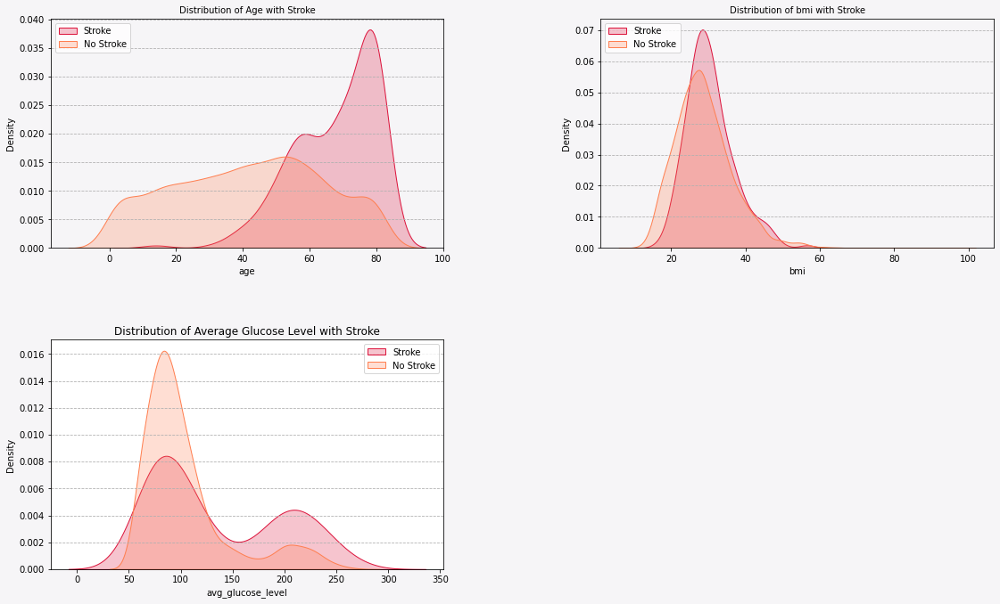
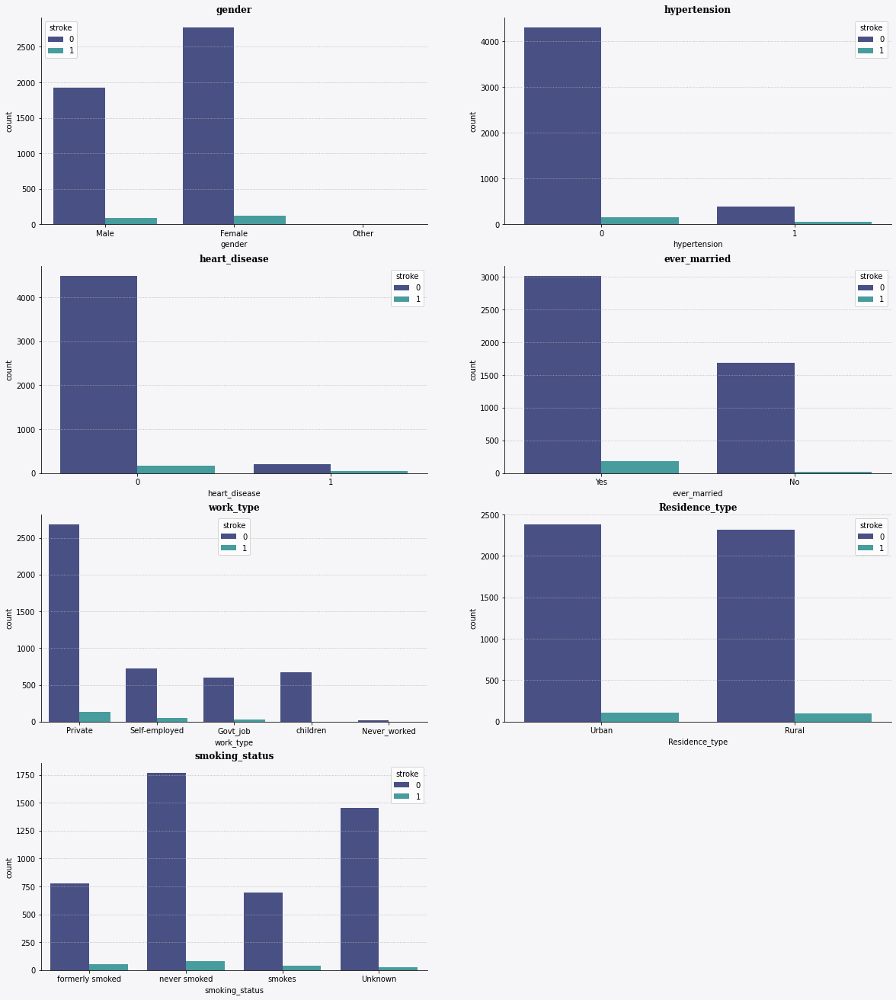
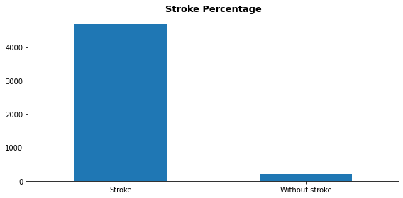
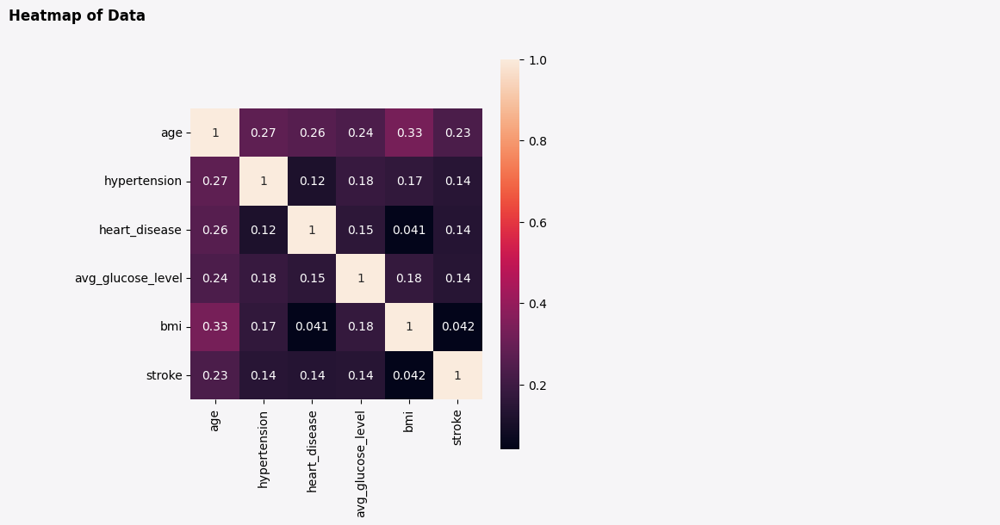
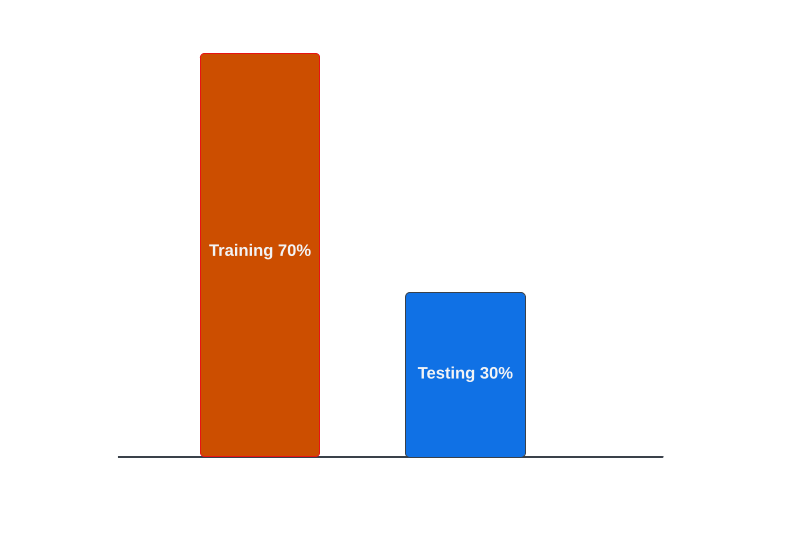
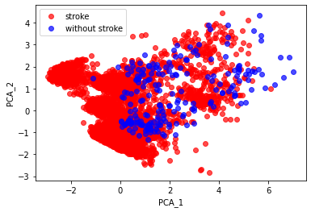
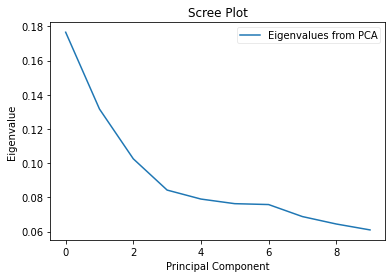
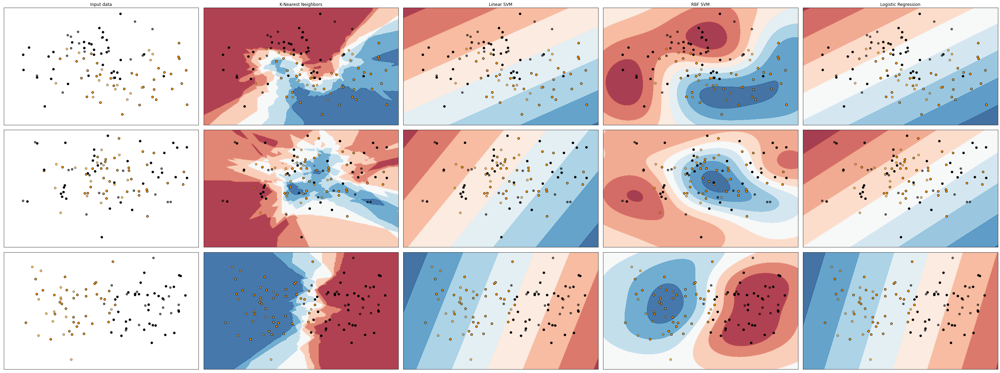
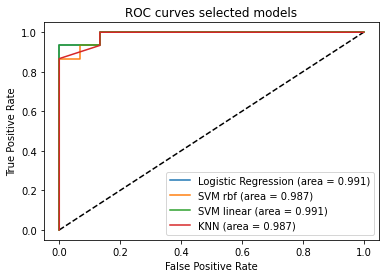
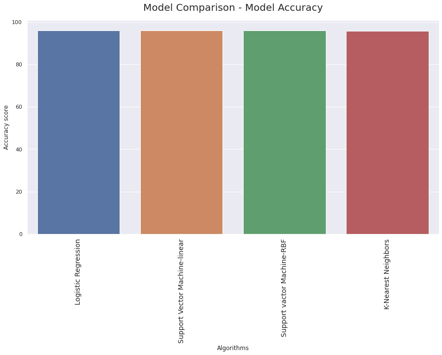

# Machine learning approach for Stroke prediction

The data for the prediction of stroke collected from kaggle database https://www.kaggle.com/fedesoriano/stroke-prediction-dataset. This data set contain 5110 observations and 12 attributions.The first column contain unique ID number of each patients.

### Step-1: Identifying the problem and data cleaning
 - Getting libraries
 - Checking for sample and feature number
 - Getting data information
 - Checking for missing values

So, here it has been observed that the sample number has been reduced to 4909 from 5110. The inputation has not performed becuse the missing value percentage is less than 50% and the feature can not be inputated (it will change the feature).
 - Saving the clean version of data

### Step-2 Exploratory data analysis (EDA)
#### Skeweness visulization of Numerical Data (Age, BMI, Average Glucose Level) in relation to Stroke

  

Observation: For distribution of age the skewness is higher in stroke patients.At the same time, bmi level is higher with stroke patient. Moreover, in response to average glucose level the skewness is extremly higher for people without stroke in comparison to stroked people.

#### Analysing categorical variable with stroke

  

#### Observations
1. The stroke rate in male and female is almost closer but female has more stroke rate than male.
2. People with hypertension and heart disease has very little stroke rate.
3. Comapred to the unmarried people, the stroke rate is higher in married people.
4. Among private, self-employed, Govt job, children and never worked persons the private job holders have the greatest stroke rate.
5. There is almost no differences in stroke occurance in urban and rural area people.
6. People who smokes and formerly smoked combainedly have higher stroke possibility than people who never smoked.

#### Stroke and non-stroke percentage
     95.74% did not have a stroke
     4.26% did have a stroke

  

#### Correlation Matrix

  

#### Observation
1. There is no strong correlation between the features.
2. The heighst correlation can be observed between bmi and age.

### Conversion of Categorical Data into Binary Data for further processing
- In order to the formation of two-dimentional binary matrix, where particular category is represented by each column, we had to convert the categorical variables into the Dummy variables.
### Step-3- Data preprocessing and model evalution
The goal of the Data Preprocessing is to find the best predictive features of the data and filter it so that it will enhance the predictive power of the analytics model.
#### Label encoding
- Here, I assign all of the features to a NumPy array X, and transform the class labels from the original string representation into integers.

#### Assessing Model Accuracy: Split data into training and test sets
The method is used to evaluate the performance of mechine learning algorithm by using different training and testing datasets.

***Split the available data into a training set and a testing set. (70% training, 30% test)

  

#### Feature Standardization
Standardization is a useful technique to transform attributes with a Gaussian distribution and differing means and standard deviations to a standard Gaussian distribution with a mean of 0 and a standard deviation of 1.
- sklearn is used to scale and transform the data in such a way so that each attribute has a mean value of zero(0) and a standard deviation of one(1).
#### Feature decomposition using Principal Component Analysis( PCA)
     n_component=10

  

Visual representation of first two principal components of stroke and without stroke patients.

#### Deciding how many Principal Components to retain

  

#### Observation

The most obvious change in slope in the scree plot occurs at component 2.5, which is the “elbow” of the scree plot. Therefore, it cound be argued based on the basis of the scree plot that the first three components should be retained.
#### Model evaluation
- Model Fitting
The following classifiers have been used 
#### Logistic Regression
#### SVM- linear kernel
#### SVM- RBF kernel
#### K-neighbour classifier

#####  Model train and test accuracy:
| Model         | train_accuracy | test_accuracy |
   |:---------------|:--------------| :----------------------------------------------------------- |
   | Logistic Regression         | 95.63               | 96.06        
   | SVM-linear | 95.61          | 96.06         
   | SVM-RBF       | 95.61          | 96.06         |
   | KNN         | 95.95          | 95.45         |
  

- Comparison of classsifiers

  

Classifier comparison among Logistic Regression, SVM-linear, SVM-RBF, k-neighbour classifier, decision tree, random forest.
The plots show training points in solid colors and testing points semi-transparent

#### ROC Curve generation

  

 Area under the ROC Curve (AUC) measures the entire two-dimensional area underneath the entire ROC curve. Here, the heighst AUC observed in the SVM-linear kernel and in Logistic Regression.

#### Model tuning for improving accuracy scores
Each classification model has been optimized.

#### Compareing of original accuracy score and tuned accuracy score

| Model         | score | tuned_score |
   |:------|:------------| :----------------------------------------------------------- |
   | Logistic Regression         | 96.06 | 96.06       
   | SVM-linear | 96.06 | 96.06       
   | SVM-RBF       | 96.06 | 96.06       |
   | KNN         | 95.79 | 95.99       |
  

#### Model Comparison

  

